# Empty States Gallery

Visual gallery of every empty state shipped in RemitWise, with the exact title, description, and CTA copy used in product. Audience: **contributors and reviewers** verifying copy consistency before merging UI changes.

For the technical catalog (component props, Lucide icons, and when each state fires), see [EMPTY_STATE_ILLUSTRATIONS.md](EMPTY_STATE_ILLUSTRATIONS.md).

---

## How to use this gallery

1. Open the SVG under each entry — it mirrors the `WidgetEmptyState` layout (icon badge → title → description → optional CTA).
2. Compare the listed copy against the source file before changing empty-state text.
3. When you add a new empty state, append a gallery card here **and** a row in [EMPTY_STATE_ILLUSTRATIONS.md](EMPTY_STATE_ILLUSTRATIONS.md).

Primary component:

```tsx
import WidgetEmptyState from '@/components/ui/WidgetEmptyState';

<WidgetEmptyState
  icon={Inbox}
  title="No transactions yet"
  description="When you send money, pay bills, or use Smart Split, your activity will show up here."
  ctaLabel="Send money"
  ctaHref="/send"
/>
```

---

## Dashboard widgets

### Recent Transactions

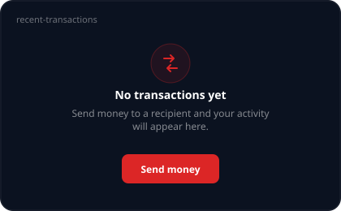

| Field | Copy |
| --- | --- |
| Title | No transactions yet |
| Description | Send money to a recipient and your activity will appear here. |
| CTA | Send money → `/send` |
| Source | `components/Dashboard/RecentTransactionsWidget.tsx` |

### Savings by Goal

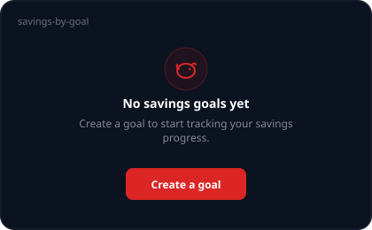

| Field | Copy |
| --- | --- |
| Title | No savings goals yet |
| Description | Create a goal to start tracking your savings progress. |
| CTA | Create a goal → `/goals` |
| Source | `components/Dashboard/SavingsByGoalWidget.tsx` |

### Money Distribution

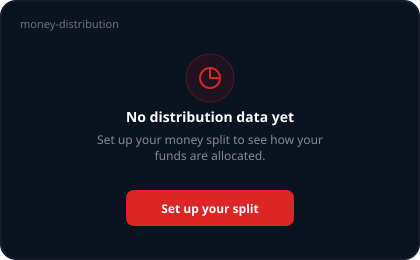

| Field | Copy |
| --- | --- |
| Title | No distribution data yet |
| Description | Set up your money split to see how your funds are allocated. |
| CTA | Set up your split → `/split` |
| Source | `components/Dashboard/MoneyDistributionWidget.tsx` |

### Six-Month Trends

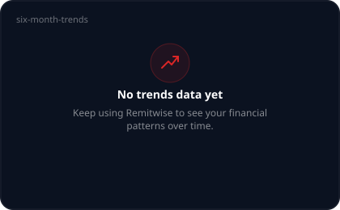

| Field | Copy |
| --- | --- |
| Title | No trends data yet |
| Description | Keep using Remitwise to see your financial patterns over time. |
| CTA | — |
| Source | `components/Dashboard/SixMonthTrendsWidget.tsx` |

---

## Insights

### Remittance Trend Chart (Activity Timeline)

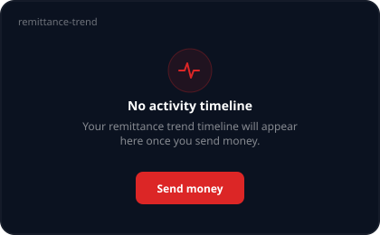

| Field | Copy |
| --- | --- |
| Title | No activity timeline |
| Description | Your remittance trend timeline will appear here once you send money. |
| CTA | Send money → `/send` |
| Source | `components/Insights/remittanceTrendChart.tsx` |

See also [activity-timeline-empty-state.md](activity-timeline-empty-state.md).

### Insights — no period data

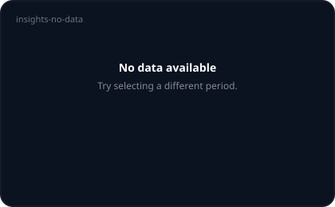

| Field | Copy |
| --- | --- |
| Title | No data available |
| Description | Try selecting a different period. |
| CTA | — |
| Source | `app/dashboard/insight/page.tsx` |

### Insights — no activity in period

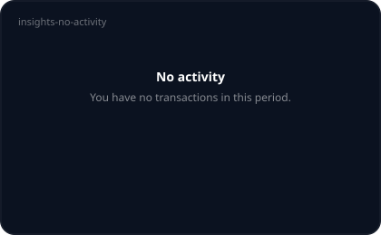

| Field | Copy |
| --- | --- |
| Title | No activity |
| Description | You have no transactions in this period. |
| CTA | — |
| Source | `app/dashboard/insight/page.tsx` |

---

## Transactions

Shared by `/transactions` and `/dashboard/transaction-history`. English strings live under `transactionHistory.*` in `lib/i18n/locales/en.json`.

### No transactions at all

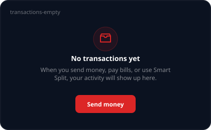

| Field | Copy |
| --- | --- |
| Title | No transactions yet |
| Description | When you send money, pay bills, or use Smart Split, your activity will show up here. |
| CTA | Send money → `/send` |
| i18n | `transactionHistory.emptyState.*` |
| Source | `app/transactions/page.tsx`, `app/dashboard/transaction-history/page.tsx` |

### No results matching filters

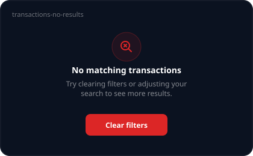

| Field | Copy |
| --- | --- |
| Title | No matching transactions |
| Description | Try clearing filters or adjusting your search to see more results. |
| CTA | Clear filters (clears active filters) |
| i18n | `transactionHistory.noResults.*` |
| Source | `app/transactions/page.tsx`, `app/dashboard/transaction-history/page.tsx` |

---

## Bills

Legacy `WidgetEmptyState` from `components/ui/WidgetStates.tsx` (fixed `AlertCircle` icon, no CTA).

### Unpaid Bills

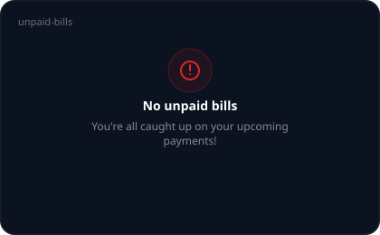

| Field | Copy |
| --- | --- |
| Title | No unpaid bills |
| Description | You're all caught up on your upcoming payments! |
| CTA | — |
| Source | `components/Bills/UnpaidBillsSection.tsx` |

### Recent Payments

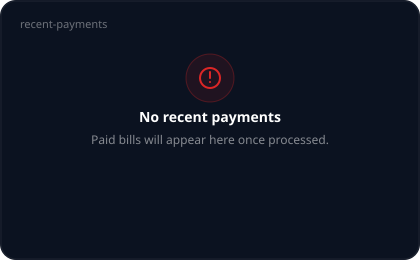

| Field | Copy |
| --- | --- |
| Title | No recent payments |
| Description | Paid bills will appear here once processed. |
| CTA | — |
| Source | `components/Bills/RecentPaymentsSection.tsx` |

---

## Send / Recurring

### Recurring Schedules

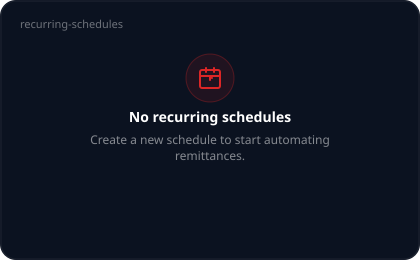

| Field | Copy |
| --- | --- |
| Title | No recurring schedules |
| Description | Create a new schedule to start automating remittances. |
| CTA | — |
| Source | `app/send/recurring/page.tsx` |

---

## Family wallet

### Member drawer — no member selected

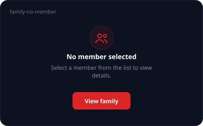

| Field | Copy |
| --- | --- |
| Title | No member selected |
| Description | Select a member from the list to view details. |
| CTA | View family → `/family` |
| i18n defaults | `familyDrawer.emptyTitle` / `emptyDescription` / `emptyCtaLabel` |
| Source | `app/family/components/FamilyMemberDetailDrawer.tsx` |

### Member drawer — no activity

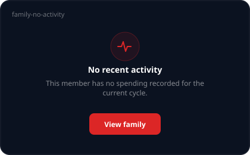

| Field | Copy |
| --- | --- |
| Title | No recent activity |
| Description | This member has no spending recorded for the current cycle. |
| CTA | View family → `/family` |
| i18n defaults | `familyDrawer.noActivityTitle` / `noActivityDescription` |
| Source | `app/family/components/FamilyMemberDetailDrawer.tsx` |

### Approvals Queue

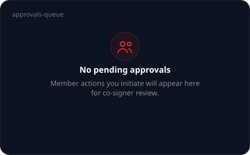

| Field | Copy |
| --- | --- |
| Title | No pending approvals |
| Description | Member actions you initiate will appear here for co-signer review. |
| CTA | — |
| i18n | `approvals_queue.empty_title` / `empty_description` |
| Source | `app/family/components/ApprovalsQueue.tsx` |

---

## Admin panel

### No audit events

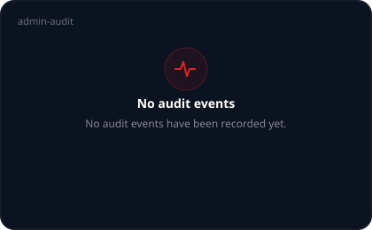

| Field | Copy |
| --- | --- |
| Title | No audit events |
| Description | No audit events have been recorded yet. |
| CTA | — |
| Source | `app/admin/page.tsx` |

### No users

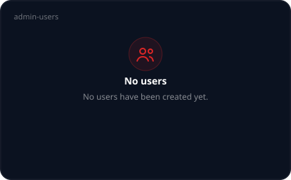

| Field | Copy |
| --- | --- |
| Title | No users |
| Description | No users have been created yet. |
| CTA | — |
| Source | `app/admin/page.tsx` |

### No DLQ events

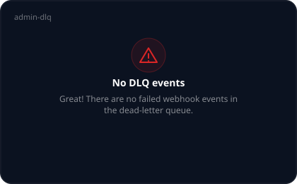

| Field | Copy |
| --- | --- |
| Title | No DLQ events |
| Description | Great! There are no failed webhook events in the dead-letter queue. |
| CTA | — |
| Source | `app/admin/page.tsx` |

---

## Quick copy index

| Surface | Title | CTA |
| --- | --- | --- |
| Recent Transactions | No transactions yet | Send money |
| Savings by Goal | No savings goals yet | Create a goal |
| Money Distribution | No distribution data yet | Set up your split |
| Six-Month Trends | No trends data yet | — |
| Remittance Trend Chart | No activity timeline | Send money |
| Insights (no data) | No data available | — |
| Insights (no activity) | No activity | — |
| Transaction history | No transactions yet | Send money |
| Transaction filters | No matching transactions | Clear filters |
| Unpaid Bills | No unpaid bills | — |
| Recent Payments | No recent payments | — |
| Recurring Schedules | No recurring schedules | — |
| Family drawer (none) | No member selected | View family |
| Family drawer (activity) | No recent activity | View family |
| Approvals Queue | No pending approvals | — |
| Admin audit | No audit events | — |
| Admin users | No users | — |
| Admin DLQ | No DLQ events | — |

---

## Related documentation

- [EMPTY_STATE_ILLUSTRATIONS.md](EMPTY_STATE_ILLUSTRATIONS.md) — icon + props catalog
- [activity-timeline-empty-state.md](activity-timeline-empty-state.md) — Activity Timeline design rationale
- [ONBOARDING_UX.md](ONBOARDING_UX.md) — when to use empty state vs onboarding vs tutorial
- [COMPONENT_STATES.md](COMPONENT_STATES.md) — default / error / loading state patterns
- [`components/ui/WidgetEmptyState.tsx`](../components/ui/WidgetEmptyState.tsx) — primary component source
