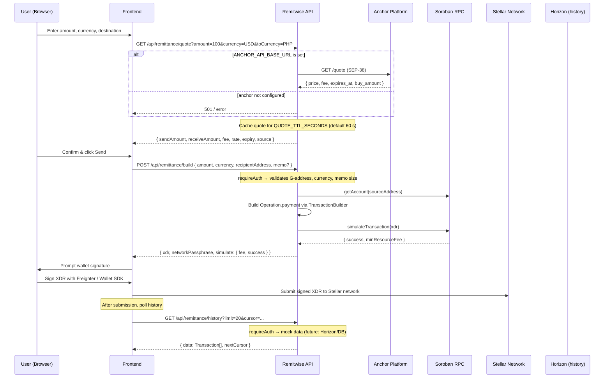

# Remittance Flow — Quote → Build → Submit → History

## 1. Overview

The Remitwise remittance pipeline lets an authenticated user send a cross-border payment
from their Stellar wallet. The lifecycle has three server-side phases plus a client-side
submission step:

1. **Quote** — fetch an exchange-rate quote (via SEP-38 anchor or cache).
2. **Build** — construct and simulate an unsigned Stellar transaction.
3. **Submit** *(client-side)* — the user signs the XDR with their wallet and submits it
   to the Stellar network.
4. **History** — query past transactions (placeholder mock data or Horizon-backed).

No single endpoint owns the entire flow; the frontend orchestrates calls across the
server API and the Stellar network directly.

---

## 2. Sequence Diagram



---

## 3. Quote Phase

### 3a. Route — `app/api/remittance/quote/route.ts`

- **Method:** `GET`
- **Middleware:** `validatedRoute` with `quoteSchema` (Zod).
- **Query parameters (all required):**
  | Param        | Type   | Description                              |
  |--------------|--------|------------------------------------------|
  | `amount`     | number | Positive amount to send                  |
  | `currency`   | string | 3-letter ISO source currency (e.g. USD)  |
  | `toCurrency` | string | 3-letter ISO destination currency (e.g. PHP) |

- **Success shape:** `{ sendAmount, receiveAmount, fee, rate, expiry: ISO-8601, source: "anchor" }`
- **Caching (in-memory):**
  - `QUOTE_TTL_SECONDS` — environment variable (default `60`).
  - Cache key: `"${amount}:${currency}:${toCurrency}"` (lowercased).
  - Entries are evicted on read-after-expiry.
  - Response headers include `X-Cache: HIT|MISS` and `Cache-Control: max-age=…`.

### 3b. Anchor integration (SEP-38)

When `ANCHOR_API_BASE_URL` is set, the quote route delegates to a SEP-38-compatible
anchor `GET /quote` endpoint:

- `sell_asset` → `iso4217:${currency}`
- `sell_amount` → `String(amount)`
- `buy_asset` → `iso4217:${toCurrency}`
- `type` → `firm`

The anchor response is remapped to the internal shape. Fields: `price`, `fee.total`,
`sell_amount`, `buy_amount`, `expires_at`.

Source: `app/api/remittance/quote/route.ts:100–138`

### 3c. Fallback when anchor is absent

If `ANCHOR_API_BASE_URL` is not set, `resolveQuote()` throws
`"Unable to resolve quote"` and the route returns a `CONTRACT_ERROR` JSON error
(`app/api/remittance/quote/route.ts:143–149`).

---

## 4. Build Phase

### 4a. Route — `app/api/remittance/build/route.ts`

- **Method:** `POST`
- **Auth:** `requireAuth()` — extracts the user's Stellar public key from the session.
- **Request body:**
  ```ts
  { amount: number; currency?: string; recipientAddress: string; memo?: string }
  ```
- **Validation (`validateBuildRequest`, lines 56–99):**
  - `amount` must be a finite positive number.
  - `recipientAddress` must be a valid Ed25519 public key (`G…`).
  - `currency` must be `"XLM"` or `"USDC"` (defaults to `"USDC"`).
  - `memo` — `Memo.text`, limited to **28 bytes**.
- **Transaction construction:**
  1. Load source account via `SorobanRpc.Server.getAccount()` to obtain the current
     sequence number.
  2. Determine asset:
     - `XLM` → `Asset.native()`
     - `USDC` → `new Asset('USDC', issuer)` where `issuer` comes from
       `USDC_ISSUER_ADDRESS` env var, defaulting to the Circle testnet issuer
       `GBBD47IF6LWK7P7MDEVSCWR7DPUWV3NY3DTQEVFL4NAT4AQH3ZLLFLA5`.
  3. `Operation.payment({ destination, asset, amount: amount.toFixed(7) })`.
  4. `Memo.text(memo)` if provided.
  5. `setTimeout(300)` — 5-minute transaction expiry.
- **Simulation:**
  - `server.simulateTransaction()` catches errors early.
  - Error heuristics detect "insufficient balance" and "invalid destination".
- **Response:**
  ```ts
  { xdr: string; networkPassphrase: string; simulate: { fee: string; success: boolean } }
  ```
- **Soroban RPC client:** `lib/soroban/client.ts`
  - `SOROBAN_RPC_URL` env var (defaults to `https://soroban-testnet.stellar.org`).
  - Lazy singleton, 10-second timeout, 1 automatic retry via `withRetry()`.

### 4b. Split Allocation — `lib/remittance/split.ts`

The split module computes how a remittance is divided across four buckets:

| Bucket      | Default % |
|-------------|-----------|
| Spending    | 50        |
| Savings     | 30        |
| Bills       | 15        |
| Insurance   | 5         |

- **`computeAllocation(amount, config?)`** — applies the percentages with
  `Math.round()`. The **spending bucket absorbs any remainder** so the four buckets
  always sum to the input amount (max 1-unit discrepancy).
- **`getSplitConfig(userAddress?)`** — currently returns `DEFAULT_SPLIT_CONFIG`.
  Future work: read from a `REMITTANCE_SPLIT` Soroban contract or database, keyed by
  user address.
- **Contract ID resolution:** `lib/contracts/network-resolution.ts` resolves contract
  addresses via `CONTRACT_IDS_JSON` or network-scoped env vars
  (e.g. `REMITTANCE_SPLIT_CONTRACT_ID_TESTNET`).

---

## 5. Submit Phase (Client-Side)

Remitwise does **not** provide a server endpoint for final submission. After the
frontend receives the unsigned XDR from `/api/remittance/build`:

1. The user signs the XDR with their Stellar wallet (e.g. Freighter browser extension).
2. The frontend submits the signed envelope directly to the Stellar network via a
   Horizon endpoint or Soroban RPC `sendTransaction`.

This design keeps private keys entirely client-side.

---

## 6. History Phase

### 6a. Route — `app/api/remittance/history/route.ts`

- **Method:** `GET`
- **Auth:** `requireAuth()`
- **Query params:** `limit` (number), `cursor` (string)
- **Pagination:** `lib/utils/pagination` → `validatePaginationParams` + `paginateData`.
- **Current implementation:** Returns a hardcoded array of 10 `Transaction` objects
  with cursor pagination.
- **Note:** The mock data is a placeholder. Production should query either Horizon or a
  contract event store.

Also exposes a `POST` stub for future transaction creation.

### 6b. Horizon-backed History — `lib/remittance/horizon.ts`

| Function                    | Purpose                                              |
|-----------------------------|------------------------------------------------------|
| `getHorizonServer()`        | Returns a lazy singleton `Horizon.Server` instance   |
| `fetchTransactionHistory()` | Fetches payment operations for an account, paginated |
| `fetchTransactionStatus()`  | Looks up a single transaction by 64-char hex hash    |
| `mapPaymentToTx()`          | Maps a `PaymentOperationRecord` → `TransactionItem`  |

- **`HORIZON_URL`** — environment variable, defaults to `https://horizon-testnet.stellar.org`.
- **Rate-limit caveat:** Public testnet Horizon throttles at **~3500 requests per hour
  per IP**. A production deployment **must** either:
  - Run a private Horizon instance, or
  - Use SDF's mainnet endpoint with appropriate backoff/retry logic.
- **Pending transactions:** `fetchTransactionHistory()` returns an empty array when
  `status: "pending"` is requested, because Horizon only stores finalized ledger data.
  `fetchTransactionStatus()` returns `"not_found"` for hashes that are not yet
  confirmed (HTTP 404 from Horizon).

### 6c. Recurring Remittances — `lib/remittance/recurring-store.ts`

Two store implementations:
- `InMemoryRecurringRemittanceStore` — ephemeral, no persistence.
- `PrismaRecurringRemittanceStore` — persisted via Prisma/SQLite.

Supports frequencies: `weekly`, `biweekly`, `monthly`. Validates recipient G-address
and positive amounts via `validateRecurringRemittanceInput()`.

---

## 7. Environment Variable Reference

| Variable | Source File | Required | Default | Description |
|---|---|---|---|---|
| `QUOTE_TTL_SECONDS` | `app/api/remittance/quote/route.ts:72` | No | `60` | Quote cache TTL in seconds |
| `ANCHOR_API_BASE_URL` | `app/api/remittance/quote/route.ts:101`, `lib/anchor/client.ts:55` | Conditional | — | Base URL for SEP-38 anchor API. Required for quote resolution |
| `ANCHOR_API_KEY` | `lib/anchor/client.ts:56` | No | — | Bearer token for anchor requests |
| `ANCHOR_DEPOSIT_PATH` | `lib/anchor/client.ts:57` | No | `/transactions/deposit/interactive` | Deposit flow path |
| `ANCHOR_WITHDRAW_PATH` | `lib/anchor/client.ts:58` | No | `/transactions/withdraw/interactive` | Withdraw flow path |
| `USDC_ISSUER_ADDRESS` | `app/api/remittance/build/route.ts:128` | No | `GBBD47IF6LWK7P7MDEVSCWR7DPUWV3NY3DTQEVFL4NAT4AQH3ZLLFLA5` | USDC issuer on the configured network |
| `SOROBAN_RPC_URL` | `lib/soroban/client.ts:22–31` | No | `https://soroban-testnet.stellar.org` | Soroban RPC endpoint for transaction building |
| `HORIZON_URL` | `lib/remittance/horizon.ts:14–15` | No | `https://horizon-testnet.stellar.org` | Horizon endpoint for history queries |
| `SOROBAN_NETWORK` | `lib/contracts/network-resolution.ts:63–77` | No | `testnet` | Network selector (`testnet` or `mainnet`) |
| `STELLAR_NETWORK` | `lib/contracts/network-resolution.ts:65` | No | `testnet` | Fallback alias for `SOROBAN_NETWORK` |
| `CONTRACT_IDS_JSON` | `lib/contracts/network-resolution.ts:84–93` | No | — | JSON blob of contract IDs keyed by network |
| `REMITTANCE_SPLIT_CONTRACT_ID*` | `lib/contracts/network-resolution.ts:13` | Conditional | — | Remittance split contract ID (network-scoped or bare) |
| `SESSION_PASSWORD` | `lib/session` (via `requireAuth`) | **Yes** | — | Session encryption key (32+ chars) |

---

## 8. Threat Model & Incident Prevention

| Risk | Mitigation | Location |
|---|---|---|
| Stale exchange rate binding | In-memory cache evicts after `QUOTE_TTL_SECONDS`; quote has its own `expiry` field | `app/api/remittance/quote/route.ts:72,83–89` |
| Invalid recipient address | `StrKey.isValidEd25519PublicKey()` rejects bad G-addresses | `app/api/remittance/build/route.ts:74` |
| In-flight transaction failure | `simulateTransaction()` catches insufficient balance and invalid destination before signing | `app/api/remittance/build/route.ts:244–262` |
| Memo overflow | 28-byte UTF-8 limit enforced via `TextEncoder` | `app/api/remittance/build/route.ts:87–90` |
| Unauthenticated access | `requireAuth()` on every remittance endpoint | `app/api/remittance/build/route.ts:215`, `history/route.ts:36` |
| Horizon rate-limit hammering | Documented public testnet limit (~3500/hr/IP); production should run private Horizon | `lib/remittance/horizon.ts:7–9` |
| Split rounding leakage | Spending bucket absorbs remainder; max 1-unit discrepancy | `lib/remittance/split.ts:49–56` |
| Anchor unavailability | Graceful error path when `ANCHOR_API_BASE_URL` is unset | `app/api/remittance/quote/route.ts:143–149` |

---

## 9. File Map

| File | Purpose |
|---|---|
| `app/api/remittance/quote/route.ts` | Exchange-rate quote endpoint (SEP-38 anchor or error) |
| `app/api/remittance/qoute/route.ts` | Deprecated alias; re-exports `GET` from `quote/route` |
| `app/api/remittance/build/route.ts` | Builds + simulates unsigned Stellar payment transaction |
| `app/api/remittance/history/route.ts` | Transaction history (mock data; Horizon-backed in future) |
| `lib/remittance/horizon.ts` | Horizon.Server singleton, payment mapper, history fetcher |
| `lib/remittance/split.ts` | Split allocation calculator (spending/savings/bills/insurance) |
| `lib/remittance/recurring-store.ts` | Recurring remittance schedule CRUD (in-memory + Prisma) |
| `lib/soroban/client.ts` | Soroban RPC server singleton with timeout/retry |
| `lib/anchor/client.ts` | Anchor API client (rates, quotes, deposit/withdraw flows) |
| `lib/contracts/network-resolution.ts` | Network detection + contract ID resolution |
| `lib/utils/pagination.ts` | Cursor-based pagination helpers |
| `.env.example` | Documented env vars for all Stellar/anchor config |
