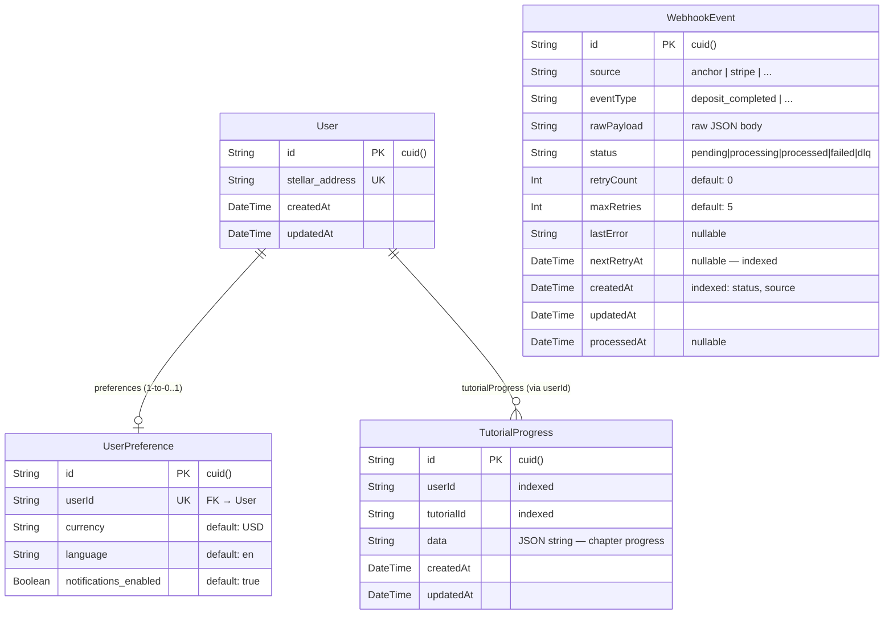

# Data Model

This document describes the Prisma-managed persistence layer for RemitWise, the
durability boundary between on-chain, in-memory, and database-persisted entities,
and the connection-management conventions in `lib/prisma.ts` / `lib/db.ts`.

---

## Entity-Relationship Diagram



---

## Model Reference

### `User`

Represents an authenticated RemitWise account. The primary identifier is
`stellar_address` (unique), which anchors the account to the Stellar network.

| Field             | Type     | Constraints          | Notes                          |
|-------------------|----------|----------------------|--------------------------------|
| `id`              | `String` | PK, `@default(cuid())` | Internal surrogate key       |
| `stellar_address` | `String` | `@unique`            | Stellar public key (G…)       |
| `createdAt`       | `DateTime` | `@default(now())`  |                                |
| `updatedAt`       | `DateTime` | `@updatedAt`       | Auto-updated by Prisma         |

**Relations:** `preferences` → one optional `UserPreference`.

---

### `UserPreference`

Stores per-user UI and notification settings. Linked 1-to-0..1 with `User`
(cascade-deleted when the user is deleted).

| Field                   | Type      | Default  | Notes                             |
|-------------------------|-----------|----------|-----------------------------------|
| `id`                    | `String`  | `cuid()` | PK                                |
| `userId`                | `String`  | —        | UK, FK → `User.id`; `onDelete: Cascade` |
| `currency`              | `String`  | `"USD"`  | ISO 4217 code                     |
| `language`              | `String`  | `"en"`   | BCP 47 language tag               |
| `notifications_enabled` | `Boolean` | `true`   |                                   |

---

### `TutorialProgress`

Tracks a user's progress through in-app tutorials. One row per
`(userId, tutorialId)` pair; `data` is stored as a JSON string because
the SQLite provider does not support native `Json` column type.

| Field        | Type       | Notes                                      |
|--------------|------------|--------------------------------------------|
| `id`         | `String`   | PK, `cuid()`                               |
| `userId`     | `String`   | Indexed; not a foreign key constraint (no cascade — user deletion does not auto-delete progress) |
| `tutorialId` | `String`   | Indexed; identifies the tutorial slug      |
| `data`       | `String`   | Serialised JSON — chapter completion flags |
| `createdAt`  | `DateTime` | `@default(now())`                          |
| `updatedAt`  | `DateTime` | `@updatedAt`                               |

**Unique constraint:** `@@unique([userId, tutorialId])`.  
**Indexes:** `@@index([userId])`, `@@index([tutorialId])`.

---

### `WebhookEvent`

Persists raw webhook payloads from external providers (anchor, Stripe, …) with
a retry queue. Rows advance through a status lifecycle and are never hard-deleted
— failed events move to `dlq` for manual inspection.

| Field         | Type       | Notes                                                        |
|---------------|------------|--------------------------------------------------------------|
| `id`          | `String`   | PK, `cuid()`                                                 |
| `source`      | `String`   | Provider name — `"anchor"`, `"stripe"`, … Indexed.           |
| `eventType`   | `String`   | Provider-specific event name — `"deposit_completed"`, …      |
| `rawPayload`  | `String`   | Full JSON body of the webhook as received                     |
| `status`      | `String`   | `pending` → `processing` → `processed` \| `failed` \| `dlq` Indexed. |
| `retryCount`  | `Int`      | Number of processing attempts so far                         |
| `maxRetries`  | `Int`      | Max attempts before moving to `dlq` (default 5)              |
| `lastError`   | `String?`  | Last error message; `null` while pending/processing          |
| `nextRetryAt` | `DateTime?`| Scheduled retry time; `null` if not retrying. Indexed.       |
| `createdAt`   | `DateTime` | `@default(now())`                                            |
| `updatedAt`   | `DateTime` | `@updatedAt`                                                 |
| `processedAt` | `DateTime?`| Set when `status = 'processed'`                              |

**Indexes:** `@@index([status])`, `@@index([source])`, `@@index([nextRetryAt])`.

---

## Durability Map

| Domain entity            | Where stored     | Notes                                                          |
|--------------------------|------------------|----------------------------------------------------------------|
| User account             | **DB** (`User`)  | Created on first login via `stellar_address`                   |
| User preferences         | **DB** (`UserPreference`) | Currency, language, notification toggle                |
| Tutorial progress        | **DB** (`TutorialProgress`) | Per-tutorial chapter completion                      |
| Webhook events           | **DB** (`WebhookEvent`) | All raw payloads + retry state                          |
| Remittance transactions  | **On-chain** (Stellar) | Settled on the Stellar network; not stored in the DB    |
| Savings goals            | **On-chain** (Soroban) | Smart-contract state (`lib/contracts/savings-goals.ts`) |
| Anchor flow state        | **In-memory**    | `AnchorSession` lives in the Next.js process; not persisted    |
| Recurring remittance schedule | **In-memory** | Managed in-session; persistence is a planned feature         |
| Insurance / bill records | **In-memory** (mock) | Contract-backed; DB persistence is planned                |
| Financial insights data  | **In-memory** (mock) | `GET /api/insights` uses mock transactions; DB integration planned |

> **Planned models** (not yet in schema):  
> `AnchorFlowAuditLog` — durable record of each anchor interaction.  
> `RecurringSchedule` — cron-like records for recurring remittances.  
> `BillRecord` / `InsurancePolicy` — move bills & insurance out of mock/on-chain into DB for faster queries.

---

## Connection Management

Both `lib/prisma.ts` and `lib/db.ts` export a singleton `PrismaClient` that
injects three connection-string parameters at startup via `getDatabaseUrl()`:

| Parameter          | Default | Purpose                                                  |
|--------------------|---------|----------------------------------------------------------|
| `connection_limit` | `10`    | Max simultaneous DB connections in the pool              |
| `connect_timeout`  | `5` s   | Fail fast if a connection cannot be established quickly  |
| `pool_timeout`     | `5` s   | Fail fast if a free connection is not available in time  |

The parameters are appended only if absent, so a `DATABASE_URL` that already
includes them is left unchanged.

### Dev-global singleton pattern

```ts
// lib/prisma.ts (simplified)
const globalForPrisma = global as unknown as { prisma: PrismaClient }

export const prisma =
  globalForPrisma.prisma ||
  new PrismaClient({ datasources: { db: { url: dbUrl } }, log: ['error'] })

if (process.env.NODE_ENV !== 'production') globalForPrisma.prisma = prisma
```

In development, Next.js hot-reloads modules on every file save. Without the
global singleton, each reload would create a new `PrismaClient` and exhaust the
connection pool. Storing the instance on `global` ensures only one client exists
per Node.js process regardless of how many times the module is evaluated.

> `lib/db.ts` uses the same pattern with `declare global { var prisma: PrismaClient | undefined }`.
> The two files are equivalent; `lib/prisma.ts` is the canonical one — prefer
> importing `{ prisma }` from `@/lib/prisma` in new code.

---

## See Also

- [`prisma/schema.prisma`](../prisma/schema.prisma) — authoritative schema source
- [`lib/README.md`](./README.md) — library module overview
- [`lib/prisma.ts`](./prisma.ts) — Prisma client singleton (canonical)
- [`lib/db.ts`](./db.ts) — Prisma client singleton (legacy alias)
- [`prisma/migrations/`](../prisma/migrations/) — applied migration history
