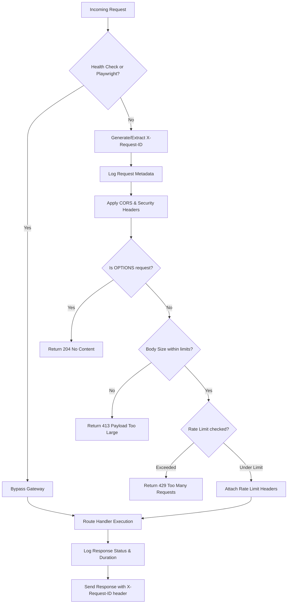

# RemitWise Infrastructure Layer Guide

This document describes the cross-cutting infrastructure and request gateway layer of RemitWise. Understanding this flow is essential for implementing secure endpoints and safe background jobs.

---

## 1. Request Lifecycle & Gateway

Every API request entering the application flows through the Next.js request gateway defined in [middleware.ts](file:///c:/Users/U%20S%20E%20R/Drips/Devfoma/Remitwise-Frontend/middleware.ts).

### End-to-End Request Flow Diagram



### Gateway Phases

1. **Test & Health Bypasses**:
   - Playwright test headers (in non-production environments) and health endpoints (`/api/health/*`) bypass rate limits and size validation to ensure uptime check reliability.
2. **Correlation ID Generation**:
   - Generates or normalizes the correlation ID (`X-Request-ID`) using `generateRequestId` in [requestId.ts](file:///c:/Users/U%20S%20E%20R/Drips/Devfoma/Remitwise-Frontend/lib/requestId.ts) for logging traceability.
3. **Structured Request Logging**:
   - Logs basic HTTP request details (method, path, user agent) but **never logs request bodies** to avoid credential leakage.
4. **CORS & Security Headers**:
   - Configures headers for Allowed Origins (based on the `ALLOWED_ORIGINS` env var), allows credentials, and enforces security headers:
     - `Content-Security-Policy`: strict `default-src 'none'` setup
     - `Strict-Transport-Security`: forces HTTPS
     - `X-Content-Type-Options`: `nosniff`
     - `X-Frame-Options`: `DENY`
     - `X-XSS-Protection`: `1; mode=block`
5. **Body Size Validation**:
   - Rejects requests exceeding `API_MAX_BODY_SIZE` (default 1MB) with a `413 Payload Too Large` error.
6. **Tiered Rate Limiting**:
   - Evaluates rate limit buckets and responds with a `429 Too Many Requests` (including standard `Retry-After` and reset headers) if thresholds are breached.

---

## 2. Tiered Rate Limiting

RemitWise implements an in-memory sliding window rate limiter backed by an `LRUCache`. Clients are identified by their IP address (extracted from `X-Forwarded-For` or `X-Real-IP`).

| Tier | Limit | Scope / Match Rule | Purpose |
| --- | --- | --- | --- |
| **Auth** | 10 requests / min | Routes starting with `/api/auth/` | Protects authentication/session endpoints against brute force attacks. |
| **Write** | 50 requests / min | `POST`, `PUT`, `DELETE`, `PATCH` methods (non-auth) | Prevents database exhaustion and contract transaction spamming. |
| **General**| 100 requests / min| `GET` requests and all other routes | Handles standard read operations and public page views. |

---

## 3. Logging & Sanitization Contract

Logging in RemitWise is structured and outputs JSON format, allowing easy indexing by logging aggregators. 

### Configuration

- Enforced by `LOG_LEVEL` environment variable (`debug`, `info`, `warn`, `error`).
- Default level is `info`.

### Redaction Rules

To prevent PII (Personally Identifiable Information) and credential leakage into logs, RemitWise enforces strict sanitization in [sanitize.ts](file:///c:/Users/U%20S%20E%20R/Drips/Devfoma/Remitwise-Frontend/lib/sanitize.ts):

- **`SENSITIVE_FIELDS` (Redacted completely)**:
  Fields like `password`, `secret`, `token`, `apikey`, `private_key`, `session_id`, `authorization`, `credit_card`, and `pin` are fully replaced with `[REDACTED]`.
- **`PARTIAL_MASK_FIELDS` (Partially masked)**:
  - **Emails**: `user@example.com` becomes `us***@***`
  - **Stellar public keys & addresses**: `GBBD47...` becomes `GBXXXX***` (via `sanitizeWalletAddress`)
  - **Phone numbers**: `+1234567890` becomes `+123***7890`

### Contributor Rule

> [!IMPORTANT]
> **Never log raw request/response bodies without sanitizing.**
> Always pass payloads through `sanitizeObject(data)` before logging them.
> Prefer logging specific identifiers rather than complete objects where possible.

---

## 4. Background Runtime & Graceful Shutdown

For tasks that run out-of-band (e.g. processing webhooks, processing retries), RemitWise provides an in-process, drain-safe runtime in [runtime.ts](file:///c:/Users/U%20S%20E%20R/Drips/Devfoma/Remitwise-Frontend/lib/background/runtime.ts).

### Core Concepts

- **`runBackgroundJob(jobName, fn)`**:
  Registers an asynchronous callback with the background runtime. It tracks the running Promise in an active job set.
- **Graceful Shutdown Hooks**:
  Listens for `SIGTERM` and `SIGINT` signals, sets the system status to `isShuttingDown() === true` (blocking new background jobs), triggers registered hooks, and waits up to `SHUTDOWN_TIMEOUT_MS` (default 15 seconds) for in-flight jobs to drain before terminating.

### Worked Example: Anchor Webhook

The Anchor Webhook endpoint at [route.ts](file:///c:/Users/U%20S%20E%20R/Drips/Devfoma/Remitwise-Frontend/app/api/webhooks/anchor/route.ts) demonstrates background job patterns:

1. **Shutdown Check**:
   - The route handler immediately rejects new webhooks with a `503 Service Unavailable` if the server is shutting down.
2. **Fast Response**:
   - It validates the signature, writes the raw event payload to the database, and schedules the processing logic in the background.
3. **Background Delegation**:
   - Delegation allows the API to acknowledge receipt with `200 OK` in milliseconds while executing the handler asynchronously.
   - Example:
     ```typescript
     import { runBackgroundJob } from '@/lib/background/runtime';

     export async function POST(request: NextRequest) {
       // ... validate signature and save event ...
       
       runBackgroundJob('anchor_webhook_event', async () => {
         await processWebhookEvent(eventId, handleAnchorEvent);
       }).catch(console.error);

       return NextResponse.json({ received: true, eventId }, { status: 200 });
     }
     ```
